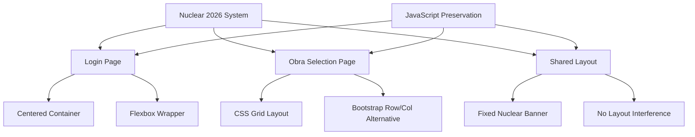

# Design Document

## Overview

This design addresses the layout misalignment issues in the Nuclear 2026 system by implementing clean CSS structure fixes while preserving all existing JavaScript functionality. The solution focuses on three main areas: login page centering, obra cards grid organization, and nuclear banner positioning.

## Architecture

The design follows a surgical approach to CSS fixes:



## Components and Interfaces

### Login Container Component
- **Purpose**: Properly center the login form on the screen
- **Implementation**: Flexbox wrapper with centering properties
- **Constraints**: Must maintain existing styling and functionality

### Obra Cards Grid Component  
- **Purpose**: Organize obra selection cards in a clean, responsive grid
- **Implementation**: CSS Grid with auto-fill and minmax sizing
- **Constraints**: Must preserve all onclick handlers and data attributes

### Nuclear Banner Component
- **Purpose**: Display system status without interfering with layout
- **Implementation**: Fixed positioning with proper z-index
- **Constraints**: Must remain visible but not push content

## Data Models

### CSS Layout Structure
```css
/* Login Page Structure */
.login-wrapper {
  display: flex;
  justify-content: center;
  align-items: center;
  min-height: 100vh;
}

.login-container {
  max-width: 400px;
  width: 100%;
}

/* Obra Cards Grid Structure */
.obras-grid {
  display: grid;
  grid-template-columns: repeat(auto-fill, minmax(250px, 1fr));
  gap: 1rem;
}

/* Nuclear Banner Structure */
.nuclear-banner {
  position: fixed;
  top: 10px;
  right: 10px;
  z-index: 9999;
}
```

## Correctness Properties

*A property is a characteristic or behavior that should hold true across all valid executions of a system-essentially, a formal statement about what the system should do. Properties serve as the bridge between human-readable specifications and machine-verifiable correctness guarantees.*

### Property 1: Login Container Centering
*For any* viewport size, the login container should be horizontally and vertically centered on the screen
**Validates: Requirements 1.2, 1.3, 1.4**

### Property 2: Obra Cards Grid Consistency  
*For any* number of obra cards, they should be arranged in a consistent grid layout with equal spacing
**Validates: Requirements 2.1, 2.2, 2.3, 2.4**

### Property 3: Nuclear Banner Non-Interference
*For any* page content, the nuclear banner should remain fixed at top-right without causing layout shifts
**Validates: Requirements 3.2, 3.4**

### Property 4: JavaScript Functionality Preservation
*For any* existing JavaScript function or event handler, it should continue to work exactly as before the CSS changes
**Validates: Requirements 4.1, 4.2, 4.3, 4.4, 4.5**

### Property 5: Responsive Layout Maintenance
*For any* screen size, the layout should remain functional and visually appropriate
**Validates: Requirements 1.5, 2.5, 5.5**

## Error Handling

### CSS Specificity Conflicts
- Use CSS specificity carefully to avoid overriding existing styles
- Prefer adding new classes over modifying existing ones
- Test changes in browser developer tools before implementation

### JavaScript Preservation
- Never modify JavaScript code during CSS fixes
- Ensure CSS changes don't affect element selectors used by JavaScript
- Maintain all data attributes and IDs used by event handlers

### Responsive Breakpoints
- Preserve all existing media queries
- Test layout changes across different screen sizes
- Ensure mobile responsiveness is maintained

## Testing Strategy

### Manual Testing Approach
- **Visual Testing**: Verify layout appearance in browser
- **Responsive Testing**: Test across different screen sizes
- **Functionality Testing**: Ensure all buttons and forms work
- **Cross-browser Testing**: Verify compatibility

### Specific Test Cases
1. **Login Page**: Verify centering on desktop, tablet, and mobile
2. **Obra Cards**: Verify grid layout with different numbers of cards
3. **Nuclear Banner**: Verify fixed positioning doesn't interfere
4. **JavaScript**: Verify all onclick handlers and form submissions work
5. **Responsive**: Verify layout adapts properly to screen size changes

### Testing Tools
- Browser developer tools for CSS inspection
- Responsive design mode for mobile testing
- Console for JavaScript error monitoring
- Visual comparison with before/after screenshots