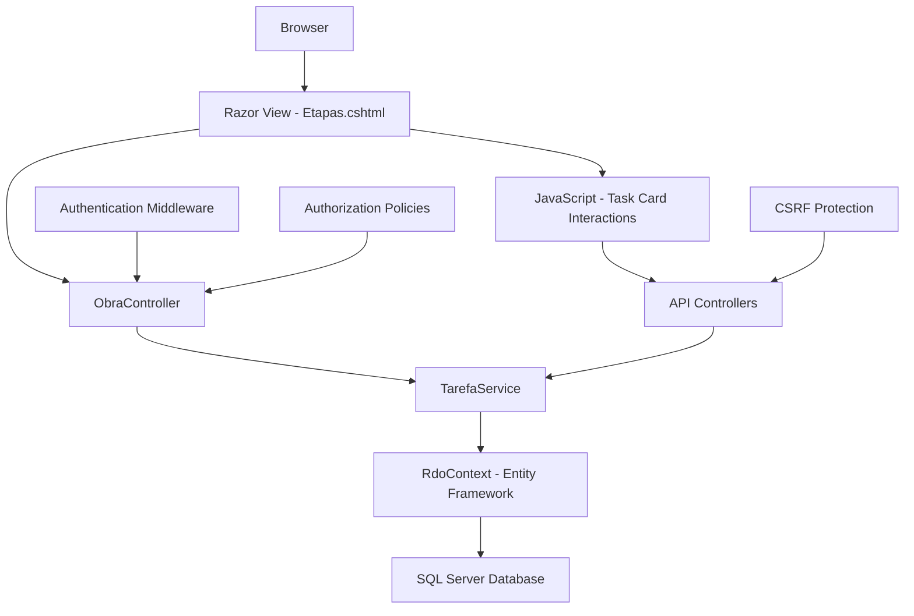
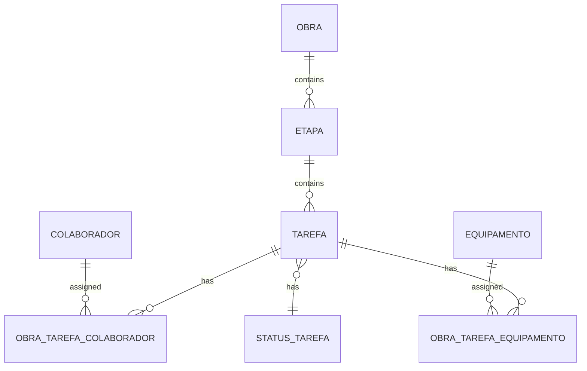

# Task Cards Implementation - Design Document

## Overview

This design document outlines the implementation of the Task Cards (Cards Tarefa) page based on Gilberto's original AngularJS implementation, adapted for the .NET 8 RDO App Piscinas system. The goal is to maintain all original functionality while improving security, performance, and maintainability using modern .NET 8 patterns.

## Architecture

### High-Level Architecture



### Component Architecture

The implementation will follow the existing .NET 8 architecture patterns:

1. **Presentation Layer**: Razor Views with Bootstrap 5 styling
2. **Controller Layer**: MVC Controllers handling HTTP requests
3. **Service Layer**: Business logic and data transformation
4. **Data Layer**: Entity Framework Core with existing entities
5. **Client-Side**: Vanilla JavaScript for interactions (no AngularJS dependency)

## Components and Interfaces

### 1. View Components

#### Primary View: `Etapas.cshtml` (Enhanced)
- **Current State**: Basic accordion layout with task cards
- **Target State**: Exact replica of Gilberto's cards.html functionality
- **Key Changes**:
  - Enhanced card layout matching original design
  - Interactive status change buttons
  - Progress bars with percentage display
  - Action buttons (view, edit, delete, history, new measurement)
  - Filtering and search functionality
  - Mass status change capability

#### Modal Components
- **History Modal**: Display task measurement history
- **New Measurement Modal**: Quick measurement entry
- **Status Change Modal**: Mass status updates
- **Report Generation Modal**: Equipment hours reports

### 2. Controller Enhancements

#### `ObraController` (Enhanced)
```csharp
public class ObraController : Controller
{
    // Existing methods...
    
    // New methods for task card functionality
    public async Task<IActionResult> GetTaskCards(int obraId, TaskCardFilterDto filter)
    public async Task<IActionResult> UpdateTaskStatus(int tarefaId, int statusId)
    public async Task<IActionResult> GetTaskHistory(int tarefaId)
    public async Task<IActionResult> DeleteTask(int tarefaId)
    public async Task<IActionResult> BulkUpdateStatus(int[] tarefaIds, int statusId)
}
```

#### New API Controller: `TaskCardApiController`
```csharp
[ApiController]
[Route("api/[controller]")]
public class TaskCardApiController : ControllerBase
{
    [HttpGet("obra/{obraId}/cards")]
    public async Task<ActionResult<TaskCardResponseDto>> GetTaskCards(int obraId, [FromQuery] TaskCardFilterDto filter)
    
    [HttpPut("{tarefaId}/status")]
    public async Task<ActionResult> UpdateTaskStatus(int tarefaId, [FromBody] UpdateStatusDto request)
    
    [HttpGet("{tarefaId}/history")]
    public async Task<ActionResult<List<TaskHistoryDto>>> GetTaskHistory(int tarefaId)
    
    [HttpDelete("{tarefaId}")]
    public async Task<ActionResult> DeleteTask(int tarefaId)
    
    [HttpPost("bulk-status-update")]
    public async Task<ActionResult> BulkUpdateStatus([FromBody] BulkStatusUpdateDto request)
}
```

### 3. Service Layer

#### Enhanced `ITarefaService`
```csharp
public interface ITarefaService
{
    // Existing methods...
    
    // New methods for task cards
    Task<TaskCardResponseDto> GetTaskCardsAsync(int obraId, TaskCardFilterDto filter);
    Task<bool> UpdateTaskStatusAsync(int tarefaId, int statusId, int userId);
    Task<List<TaskHistoryDto>> GetTaskHistoryAsync(int tarefaId);
    Task<bool> DeleteTaskAsync(int tarefaId, int userId);
    Task<bool> BulkUpdateStatusAsync(int[] tarefaIds, int statusId, int userId);
    Task<List<StatusTarefaDto>> GetAllowedStatusTransitionsAsync(int currentStatusId);
    
    // NEW: Etapa (Stage) management methods
    Task<List<EtapaWithTasksDto>> GetEtapasWithTasksAsync(int obraId, TaskCardFilterDto filter);
    Task<List<TaskCardDto>> LoadTaskCardsForEtapaAsync(string etapaTitulo, int obraId);
    Task<bool> CreateTaskInEtapaAsync(int etapaId, CreateTaskDto taskDto, int userId);
    
    // NEW: Water quality methods
    Task<WaterQualityParametersDto> GetWaterQualityParametersAsync(int tarefaId);
    Task<bool> SaveWaterQualityMeasurementAsync(int tarefaId, WaterQualityParametersDto parameters, int userId);
    Task<List<WaterQualityDropdownDto>> GetCloroOptionsAsync();
    Task<List<WaterQualityDropdownDto>> GetPHOptionsAsync();
    Task<List<WaterQualityDropdownDto>> GetAlcalinidadeOptionsAsync();
}
```

#### NEW: `IEtapaService` (Critical for Stage Management)
```csharp
public interface IEtapaService
{
    Task<List<EtapaDto>> GetEtapasForDropdownAsync(int obraId);
    Task<List<EtapaWithTasksDto>> GetEtapasWithTasksAsync(int obraId, TaskCardFilterDto filter);
    Task<EtapaDto> CreateEtapaAsync(CreateEtapaDto etapaDto, int userId);
    Task<bool> UpdateEtapaAsync(int etapaId, UpdateEtapaDto etapaDto, int userId);
    Task<bool> DeleteEtapaAsync(int etapaId, int userId);
}
```

### 4. Data Transfer Objects

#### `TaskCardDto`
```csharp
public class TaskCardDto
{
    public int Id { get; set; }
    public Guid Agrupador { get; set; }
    public string Descricao { get; set; }
    public DateTime DataInicio { get; set; }
    public DateTime? DataPrevisaoFim { get; set; }
    public DateTime? PrimeiraExecucao { get; set; }
    public DateTime? UltimaExecucao { get; set; }
    public bool ExisteExecucao { get; set; }
    public int StatusId { get; set; }
    public string StatusDescricao { get; set; }
    public string ClasseStatusCss { get; set; }
    public int PercentualConcluido { get; set; }
    public bool PercentualExtrapolado { get; set; }
    public int QuantidadeColaboradores { get; set; }
    public int QuantidadeEquipamentos { get; set; }
    public List<StatusTarefaDto> ListaStatusPermitidos { get; set; }
    public List<TaskHistoryDto> ListaHistoricoTarefa { get; set; }
    // Note: No CodigoParalisacao field - simplified pause workflow
}
```

#### `EtapaWithTasksDto` (NEW - Critical for Stage Management)
```csharp
public class EtapaWithTasksDto
{
    public int Id { get; set; }
    public string Titulo { get; set; }
    public string Descricao { get; set; }
    public List<TaskCardDto> Tarefas { get; set; }
    public bool CanAddTasks { get; set; }
    public int TotalTasks { get; set; }
    public int CompletedTasks { get; set; }
}
```

#### `WaterQualityParametersDto` (NEW - Critical for Swimming Pool Compliance)
```csharp
public class WaterQualityParametersDto
{
    public int NivelCloro { get; set; }
    public int NivelPH { get; set; }
    public int NivelAlcalinidade { get; set; }
    public bool Limpidez { get; set; }
    public bool Superficie { get; set; }
    public bool Fundo { get; set; }
    public bool Bacteria { get; set; } // FIELD NAME: "Bacteria" in code, displays as "Detritos" label in UI
    public bool Proliferacao { get; set; }
}
```

#### `WaterQualityDropdownDto` (NEW - For Dropdown Options)
```csharp
public class WaterQualityDropdownDto
{
    public int Id { get; set; }
    public string Nome { get; set; }
}

// Static dropdown data matching original exactly
public static class WaterQualityDropdowns
{
    public static List<WaterQualityDropdownDto> Cloro = new()
    {
        new() { Id = 1, Nome = "0 ppm" },
        new() { Id = 2, Nome = "0,5 < 1,0" },
        new() { Id = 3, Nome = "1,5 < 2,0" },
        new() { Id = 4, Nome = "2,5 < 3,0" },
        new() { Id = 5, Nome = "> 3,0" }
    };
    
    public static List<WaterQualityDropdownDto> PH = new()
    {
        new() { Id = 1, Nome = "< 7.0" },
        new() { Id = 2, Nome = "7.0 < 7.2" },
        new() { Id = 3, Nome = "7.2 < 7.4" },
        new() { Id = 4, Nome = "7.4 < 7.6" },
        new() { Id = 5, Nome = "7.6 < 7.8" },
        new() { Id = 6, Nome = "> 7.8" }
    };
    
    public static List<WaterQualityDropdownDto> Alcalinidade = new()
    {
        new() { Id = 1, Nome = "< 70" },
        new() { Id = 2, Nome = "70 < 80" },
        new() { Id = 3, Nome = "90 < 100" },
        new() { Id = 4, Nome = "110 < 120" },
        new() { Id = 5, Nome = "130 > 140" },
        new() { Id = 6, Nome = "> 140" }
    };
}
```

#### `TaskCardFilterDto`
```csharp
public class TaskCardFilterDto
{
    public string? Descricao { get; set; }
    public int? StatusTarefa { get; set; }
    public DateTime? DataInicial { get; set; }
    public DateTime? DataFinalPlanejada { get; set; }
    public DateTime? DataInicialExecutada { get; set; }
    public DateTime? DataFinalExecutada { get; set; }
    public int? IdEtapa { get; set; }
}
```

#### `TaskCardResponseDto`
```csharp
public class TaskCardResponseDto
{
    public List<EtapaWithTasksDto> Etapas { get; set; }
    public int TotalTasks { get; set; }
    public bool CanCreateTasks { get; set; }
    public bool CanEditTasks { get; set; }
    public bool CanDeleteTasks { get; set; }
}
```

## Data Models

### Database Schema Integration

The implementation will use existing entities without schema changes:

#### Core Entities Used
- `Tarefa` - Main task entity
- `Etapa` - Stage/phase entity
- `Obra` - Project entity
- `StatusTarefa` - Task status entity
- `Colaborador` - Worker entity
- `Equipamento` - Equipment entity
- `ObraTarefaColaborador` - Task-worker relationship
- `ObraTarefaEquipamento` - Task-equipment relationship

#### Key Relationships


### Data Calculations

#### Progress Percentage Calculation
```csharp
public static int CalcularPercentualConcluido(Tarefa tarefa)
{
    if (tarefa.StatusId == 1) return 0; // Planejada
    
    if (tarefa.DataMedicaoHoraInicial == null && tarefa.DataMedicaoHoraFinal == null)
        return 0;
    
    var totalDiasPlanejados = (tarefa.DataPrevisaoFim - tarefa.DataInicio).TotalDays;
    var diasExecutados = (DateTime.Now - tarefa.DataInicio).TotalDays;
    
    var percentual = Math.Round((diasExecutados * 100) / totalDiasPlanejados, 2);
    return (int)Math.Min(percentual, 100);
}
```

#### Status CSS Class Mapping
```csharp
public static string DeterminarClasseStatusCss(int statusId)
{
    return statusId switch
    {
        1 => "bg-cinza",      // Planejada
        2 => "bg-azul",       // Em Execução
        3 => "bg-verde",      // Finalizada
        4 => "bg-laranja",    // Paralisada (Simplified - no pause code required)
        5 => "bg-vermelho",   // Cancelada
        _ => "bg-cinza"
    };
}
```

**Important Business Rule Change**: 
The new implementation simplifies the pause workflow by removing the "código de paralisação" (pause code) requirement that existed in Gilberto's original system. Users can still pause tasks and the system will change colors and register the pause, but without the additional code input step.

## Correctness Properties

*A property is a characteristic or behavior that should hold true across all valid executions of a system-essentially, a formal statement about what the system should do. Properties serve as the bridge between human-readable specifications and machine-verifiable correctness guarantees.*

Based on the prework analysis, the following correctness properties will ensure the task cards implementation maintains fidelity to the original while meeting modern standards:

### Property 1: Visual Layout Consistency
*For any* task card rendered in the system, the visual layout should match exactly with the original Gilberto implementation including card structure, spacing, typography, and visual hierarchy
**Validates: Requirements 2.1, 2.5**

### Property 2: Status Color Coding Consistency  
*For any* task status displayed in the system, the color coding and visual indicators should match exactly with the original implementation's status color scheme
**Validates: Requirements 2.2**

### Property 3: Progress Visualization Consistency
*For any* task progress indicator displayed, the progress bars and percentage displays should match the original design and calculation methods
**Validates: Requirements 2.3**

### Property 4: Mobile Responsive Behavior
*For any* mobile device viewport, the task cards should maintain responsive behavior identical to the original implementation
**Validates: Requirements 2.4, 7.1, 7.3**

### Property 5: Data Integration Accuracy
*For any* task card displayed, all data fields should be fetched from the current .NET 8 Tarefa entity and displayed with the same formatting as the original
**Validates: Requirements 3.1, 3.2, 3.4**

### Property 6: Real-time Data Updates
*For any* database change to task data, the task cards should reflect the updated information without requiring a page refresh
**Validates: Requirements 3.5**

### Property 7: Interactive Behavior Consistency
*For any* user interaction with task card elements (clicks, hovers, actions), the system should execute the same functions and show the same feedback as the original implementation
**Validates: Requirements 4.1, 4.2, 4.3**

### Property 8: Filtering and Search Functionality
*For any* filter or search operation applied to task cards, the system should provide identical functionality and results as the original implementation
**Validates: Requirements 4.4**

### Property 9: Authentication and Authorization
*For any* task card operation, the system should implement proper authentication checks and apply role-based access control from the current RBAC system
**Validates: Requirements 5.1, 5.2**

### Property 10: Input Validation and Security
*For any* user input in task card operations, the system should validate inputs and prevent XSS attacks while maintaining the same validation rules as the original
**Validates: Requirements 5.3**

### Property 11: Performance and Efficiency
*For any* task card data loading operation, the system should use efficient database queries and meet or exceed the original system's performance benchmarks
**Validates: Requirements 5.4, 9.4**

### Property 12: System Integration Compatibility
*For any* task card operation, the system should use existing Controllers, Services, DTOs, and maintain compatibility with existing API endpoints
**Validates: Requirements 6.1, 6.3, 6.4**

### Property 13: Touch Interaction Support
*For any* touch-based interaction on mobile devices, the system should respond appropriately to tap, swipe, and pinch gestures
**Validates: Requirements 7.2**

### Property 14: Network Resilience
*For any* network error or slow connection scenario, the system should provide appropriate loading indicators and retry mechanisms
**Validates: Requirements 7.4, 8.2**

### Property 15: Error Handling and User Feedback
*For any* error condition encountered, the system should display user-friendly error messages and provide clear guidance for resolution
**Validates: Requirements 8.1, 8.3, 8.4**

### Property 17: Etapa (Stage) Management Consistency
*For any* stage-based operation (accordion expansion, task creation, filtering), the system should provide identical functionality to the original implementation including dynamic card loading and stage-specific task management
**Validates: Requirements 11.1, 11.2, 11.3, 11.4, 11.5**

### Property 18: Water Quality Field Name Consistency
*For any* water quality parameter displayed or processed, the system should use consistent field names in code (Bacteria) while displaying user-friendly labels (Detritos) in the interface
**Validates: Requirements 12.1**

### Property 19: Water Quality Dropdown Accuracy
*For any* water quality dropdown displayed (Cloro, PH, Alcalinidade), the system should provide exactly the same dropdown values and formats as the original implementation
**Validates: Requirements 12.2**

### Property 20: Water Quality Data Integration
*For any* water quality measurement or history display, the system should use lookup filters and integrate correctly with Laudo PDF generation for regulatory compliance
**Validates: Requirements 12.3, 12.4, 12.5**

## Error Handling

### Client-Side Error Handling
```javascript
class TaskCardErrorHandler {
    static handleApiError(error, operation) {
        console.error(`Error in ${operation}:`, error);
        
        if (error.status === 401) {
            window.location.href = '/Auth/Login';
            return;
        }
        
        if (error.status === 403) {
            this.showError('Você não tem permissão para realizar esta operação.');
            return;
        }
        
        if (error.status >= 500) {
            this.showError('Erro interno do servidor. Tente novamente em alguns instantes.');
            return;
        }
        
        this.showError('Erro inesperado. Verifique sua conexão e tente novamente.');
    }
    
    static showError(message) {
        // Show user-friendly error message
        const toast = document.createElement('div');
        toast.className = 'toast-error';
        toast.textContent = message;
        document.body.appendChild(toast);
        
        setTimeout(() => {
            document.body.removeChild(toast);
        }, 5000);
    }
}
```

### Server-Side Error Handling
```csharp
[HttpGet("obra/{obraId}/cards")]
public async Task<ActionResult<TaskCardResponseDto>> GetTaskCards(int obraId, [FromQuery] TaskCardFilterDto filter)
{
    try
    {
        var result = await _tarefaService.GetTaskCardsAsync(obraId, filter);
        return Ok(result);
    }
    catch (UnauthorizedAccessException)
    {
        return Forbid();
    }
    catch (ArgumentException ex)
    {
        _logger.LogWarning(ex, "Invalid parameters for GetTaskCards: {ObraId}", obraId);
        return BadRequest(new { message = "Parâmetros inválidos." });
    }
    catch (Exception ex)
    {
        _logger.LogError(ex, "Error getting task cards for obra {ObraId}", obraId);
        return StatusCode(500, new { message = "Erro interno do servidor." });
    }
}
```

## Testing Strategy

### Dual Testing Approach

The implementation will use both unit testing and property-based testing to ensure comprehensive coverage:

#### Unit Tests
- **Specific Examples**: Test concrete scenarios like "task with status 2 shows blue background"
- **Edge Cases**: Test boundary conditions like empty task lists, null values, date edge cases
- **Error Conditions**: Test error scenarios like network failures, invalid data, permission denied
- **Integration Points**: Test controller actions, service methods, data access

#### Property-Based Tests
- **Universal Properties**: Test properties that should hold for all inputs
- **Comprehensive Coverage**: Generate random test data to cover many scenarios
- **Regression Prevention**: Ensure changes don't break existing functionality
- **Performance Validation**: Test that performance requirements are met across various data sizes

### Testing Configuration

Each property-based test will:
- Run minimum 100 iterations to ensure comprehensive coverage
- Reference the corresponding design document property
- Use the tag format: **Feature: task-cards-gilberto-implementation, Property {number}: {property_text}**

### Test Categories

#### Visual Regression Tests
```csharp
[Test]
public void TaskCard_VisualLayout_MatchesOriginalDesign()
{
    // Feature: task-cards-gilberto-implementation, Property 1: Visual Layout Consistency
    // Test that rendered cards match original design
}
```

#### Functional Tests
```csharp
[Property]
public Property TaskCard_StatusColorCoding_ConsistentWithOriginal()
{
    // Feature: task-cards-gilberto-implementation, Property 2: Status Color Coding Consistency
    return Prop.ForAll(
        Gen.Choose(1, 5), // Status IDs 1-5
        statusId => {
            var cssClass = TaskCardHelper.DeterminarClasseStatusCss(statusId);
            return OriginalStatusColors.ContainsKey(statusId) && 
                   OriginalStatusColors[statusId] == cssClass;
        });
}
```

#### Performance Tests
```csharp
[Property]
public Property TaskCard_LoadingPerformance_MeetsRequirements()
{
    // Feature: task-cards-gilberto-implementation, Property 11: Performance and Efficiency
    return Prop.ForAll(
        Gen.Choose(1, 1000), // Number of tasks
        taskCount => {
            var stopwatch = Stopwatch.StartNew();
            var result = _service.GetTaskCardsAsync(1, new TaskCardFilterDto()).Result;
            stopwatch.Stop();
            
            return stopwatch.ElapsedMilliseconds < 2000; // Must load within 2 seconds
        });
}
```

#### Security Tests
```csharp
[Property]
public Property TaskCard_Authorization_EnforcesRBAC()
{
    // Feature: task-cards-gilberto-implementation, Property 9: Authentication and Authorization
    return Prop.ForAll(
        Gen.Elements(TestUsers.AllUsers),
        user => {
            var result = _controller.GetTaskCards(1, new TaskCardFilterDto(), user).Result;
            return user.HasPermission("VIEW_TASKS") ? 
                   result is OkObjectResult : 
                   result is ForbidResult;
        });
}
```

### Test Data Generation

Property-based tests will use intelligent generators:

```csharp
public static class TaskCardGenerators
{
    public static Gen<TaskCardDto> ValidTaskCard =>
        from id in Gen.Choose(1, int.MaxValue)
        from descricao in Gen.NonEmptyString
        from dataInicio in Gen.DateTimeRange(DateTime.Now.AddYears(-1), DateTime.Now)
        from statusId in Gen.Choose(1, 5)
        from percentual in Gen.Choose(0, 100)
        select new TaskCardDto
        {
            Id = id,
            Descricao = descricao,
            DataInicio = dataInicio,
            StatusId = statusId,
            PercentualConcluido = percentual,
            ClasseStatusCss = TaskCardHelper.DeterminarClasseStatusCss(statusId)
        };
}
```

This comprehensive design ensures that the task cards implementation will maintain complete fidelity to Gilberto's original design while leveraging modern .NET 8 patterns for improved security, performance, and maintainability.